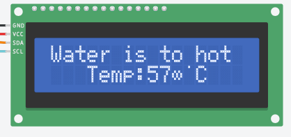
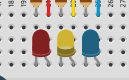

# Integrantes

Rafael Panhoca RM555014   
Guilherme oliveira RM558797

## Link simulação arduino
[Link para acessar a simulação do circuito.](https://www.tinkercad.com/things/bcqNrDfFGeI-gs-edge?sharecode=_YDHr0weDzYbh3Dkvx_XXUrBPPkq9xsOVJ9w0YGvYAA)

## Descrição do projeto

#### A FIAP propos ao seus alunos pensarem em como resolver um dos diversos problemas causados pelo ser humano e que afetam os oceanos e vida marinha
---
### Problema:

À medida que a sociedade cresce, ocupa e afeta cada vez mais os ecossistemas naturais, como florestas, rios, atmosfera e oceanos, que ao longo do tempo, têm sido impactados negativamente de diversas maneiras. Os oceanos, em particular, são um exemplo crítico desse impacto. Por muitos anos, eles foram usados como depósito de resíduos, e hoje estão colapsando, principalmente devido à poluição marinha. Plásticos, canudos, esgoto e até mesmo lixo químico eram e são descartados nos oceanos, e essas ações agora revelam suas consequências: branqueamento de corais, morte de animais marinhos, presença de plásticos no organismo de peixes, praias impróprias para uso, entre outros problemas.
Devido à vastidão dos oceanos, temos apenas uma noção parcial da real extensão desses danos. A falta de dados e a dificuldade na coleta de informações tornam possível que a situação atual dos oceanos seja ainda pior do que aparenta. Um problema crescente e ainda pouco compreendido é a presença de microplásticos, que são extremamente nocivos à natureza, mas quase invisíveis a olho nu.
É essencial aumentarmos a quantidade de dados que possuímos sobre os oceanos. Isso é fundamental para analisar de maneira precisa o estado dos ecossistemas marinhos, realizar intervenções ecológicas mais eficazes e utilizar esses mesmos dados para auxiliar a sociedade como um todo. Por exemplo, com mais dados, poderemos identificar com precisão quais praias estão impróprias para uso e encontrar soluções para esses problemas.

### Nossa Solução

Um  dispositivo de IoT simples para ser acoplado ao casco de embarcações pesqueiras. Este dispositivo terá dupla função. A primeira é atuar como um grande coletor de dados sobre o estado da água, medindo parâmetros como pH, amônia e iodo. Esses dados serão coletados continuamente e enviados para um banco de dados central, onde serão processados, analisados e usados para criar dashboards, mapas e uma série de informações.
A segunda função, embora secundária, é filtrar a água enquanto a embarcação navega, removendo microplásticos e nanoplásticos. Quando o armazenamento do dispositivo estiver cheio, os navegadores poderão levar o material coletado a centros de coleta nos portos, onde poderão descartá-los
O objetivo é criar uma solução prática para a falta de dados sobre as águas dos oceanos e obter mais informações sobre as áreas de onde vêm os peixes selvagens que consumimos. A ideia é utilizar a infraestrutura já existente das embarcações pesqueiras, que poderão instalar o dispositivo e deixá-lo funcionando automaticamente enquanto realizam suas atividades habituais.

A principal intenção é utilizar a infraestrutura já existente, primeiramente a grande quantidade de barcos pesqueiros que já navegam pelos mares. Queremos começar "unindo o útil ao agradável", criando valor para os pescadores que adquirirem este dispositivo, ao mesmo tempo em que eles nos ajudam a aprimorar e melhorar nosso sistema.

O dispositivo coleta dados sobre a qualidade da água, e nosso sistema os processa para criar um dashboard. Essa rede de dados mostrará onde a água está mais limpa, indicando regiões com peixes e outras mercadorias de pesca de melhor qualidade. Com base nesses dados, os pescadores poderão receber selos de qualidade para seus produtos, semelhantes aos selos de inspeção utilizados na pecuária, como o S.I.F.

Dessa forma, os pescadores não apenas contribuirão para o monitoramento ambiental e a limpeza dos oceanos, mas também poderão aumentar o valor de seus produtos no mercado, obtendo reconhecimento pela qualidade superior de suas capturas.

O objetivo é criar uma estrutura de coleta de dados para as mais diversas funcionalidades. Queremos focar no uso da infraestrutura já existente nos oceanos, começando com os barcos pesqueiros, mas também considerando iniciativas para outros tipos de embarcações, como navios. Ao fazer isso, esperamos mapear os oceanos de forma mais completa e eficiente.

## Simulação Arduino

#### Como apresentado a cima, o nosso IoT terá tem como função  a constante coleta de dados das águas em que estão
---
Criamos um circuito no tinkercad com o intuito de demostrar de maneira visual como seria a coleta de dados, fazemos o uso adaptado de alguns componentes para simular alguns tipos de informações coletadas

#### Componentes
- 2 LCD i2c
- Sensor de gás (para simular a quantidade de micro plásticos na água)
- Sensor de temperatura
- Potenciômetro (para simular o ph da água)
- Protoboard
- Arduino
### Adpatação 
Devido ao fato de estarmos fazendo o uso adpatado de algun compoentes, para simularmos o Ph é necessário fazer uma manipulação dos valores, igual costa no código.

#### Lógica de funcionamento
A intenção é que em um dos LCDs fique constantemente aparecendo as informações coletadas pelos sensores (Partic, Temp, Ph)

Mas se um dessas medições extrapolar um certo limite, aparecerá um alerta no lcd secundário piscando e dizendo qual medição está muito alta e um led referente ao sensor também começará a piscar.  
Os limites são de:
- maior que 600 para partículas
- maior que 30°c para temperatura
- menor que 6 para Ph

##### EasterEgg

Caso todos os sensores estrapolem o limite, uma mensagem aparecerá e todos os leds piscarão junto.

[MIT](https://choosealicense.com/licenses/mit/)
